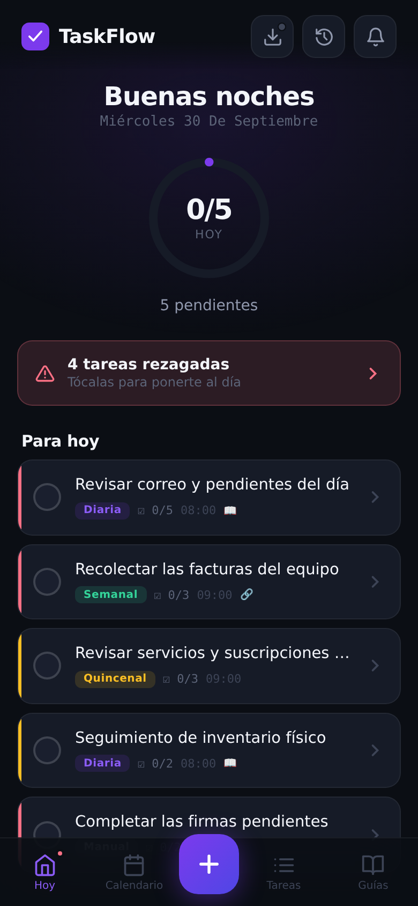
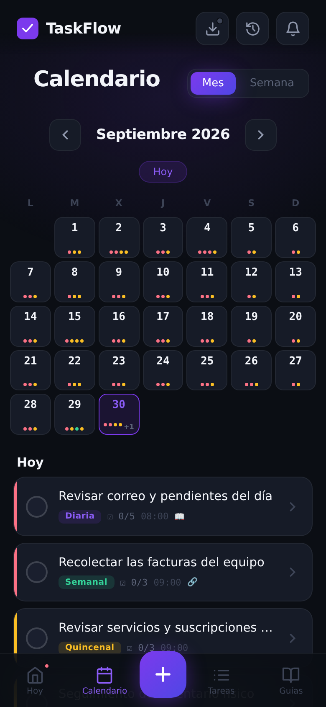
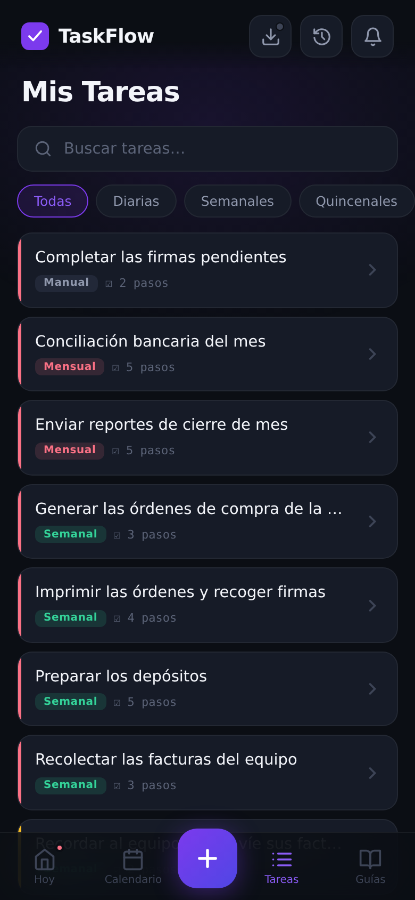
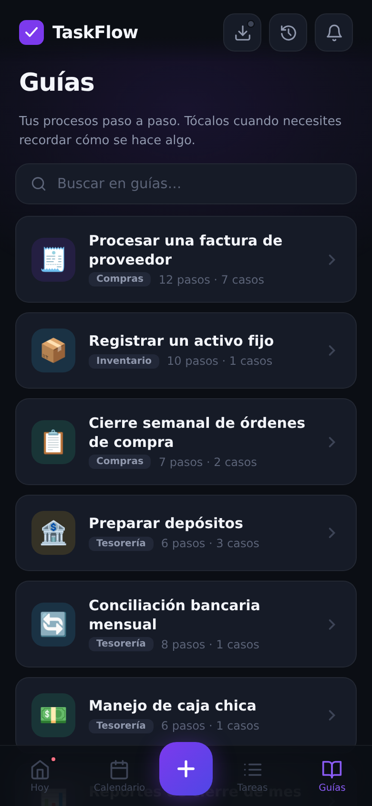
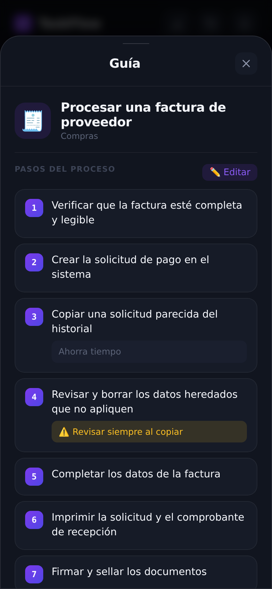

# TaskFlow

Gestor de procesos y tareas recurrentes para oficinas administrativas. Funciona en el celular como app instalable (PWA) y también sin internet.

> Muestra de portafolio con datos de ejemplo. Los procesos, nombres y montos son ficticios (empresa de ejemplo "Acme Servicios S.A.").

<p>
  
  
  
  
  
</p>

## Qué problema resuelve
En una oficina administrativa muchas tareas se repiten cada día, semana, quincena o mes, y tienen varios pasos que es fácil olvidar. TaskFlow muestra qué toca hoy, guía cada paso con una lista de verificación y guarda el historial.

## Qué hace
- **Hoy:** tareas del día y atrasadas, con su progreso.
- **Calendario:** vista mensual y semanal.
- **Tareas:** repetición diaria, semanal, quincenal, mensual, cada cuatro meses o única; prioridades, recordatorios y listas de pasos.
- **Guías:** mini-manuales con pasos, notas y casos especiales, enlazados a las tareas.
- **Plantillas** para crear tareas rápido, **historial** y **respaldo** que se puede exportar e importar.
- **Nube opcional:** sincronización entre dispositivos con Supabase (requiere iniciar sesión).

## Cómo está hecho
- HTML, CSS y JavaScript puro, sin frameworks ni paso de compilación.
- PWA instalable con modo sin conexión: el service worker pide primero a la red el código propio y usa la caché para el resto.
- Datos locales con respaldo automático y limpieza de datos viejos. Si los datos guardados no se pueden leer, la app no los reemplaza por los de ejemplo.
- Sincronización con Supabase (Auth y REST): une los cambios locales y los de la nube por identificador en vez de que uno pise al otro, y registra los borrados para que no reaparezcan tareas.

## Cómo probarlo
1. Crea un proyecto en [Supabase](https://supabase.com) y la tabla de la sección siguiente.
2. Copia `js/config.example.js` como `js/config.js` y escribe tu URL y tu llave `anon`. El archivo `config.js` está en `.gitignore`.
3. Sirve la carpeta con cualquier servidor estático y ábrela en el navegador. La app pide iniciar sesión.

## Configuración de Supabase
```sql
create table if not exists taskflow_data (
  user_id text primary key,
  data text,
  updated_at timestamptz default now()
);

alter table taskflow_data enable row level security;

create policy "solo_mi_cuenta" on taskflow_data
  for all to authenticated
  using (auth.uid()::text = user_id)
  with check (auth.uid()::text = user_id);
```
La llave `anon` es pública por diseño. La privacidad de los datos depende del inicio de sesión y de estas políticas, no de ocultar la llave.

## Límites conocidos
- Necesita una cuenta de Supabase y pide iniciar sesión: no hay modo demostración.
- Las notificaciones de una PWA en Android pueden cortarse si el sistema cierra la app.

## Cómo fue construido
Desarrollado con apoyo de IA (Claude). Yo defino qué debe hacer la app y la uso; la IA escribe gran parte del código.

## Licencia
Todos los derechos reservados. Este repositorio es una muestra de portafolio: ver `LICENSE`.

---
**English summary:** TaskFlow is an installable, offline-capable task and process manager (vanilla JS PWA with optional Supabase sync), published as a portfolio sample with fictional demo data. All rights reserved; see `LICENSE`.
